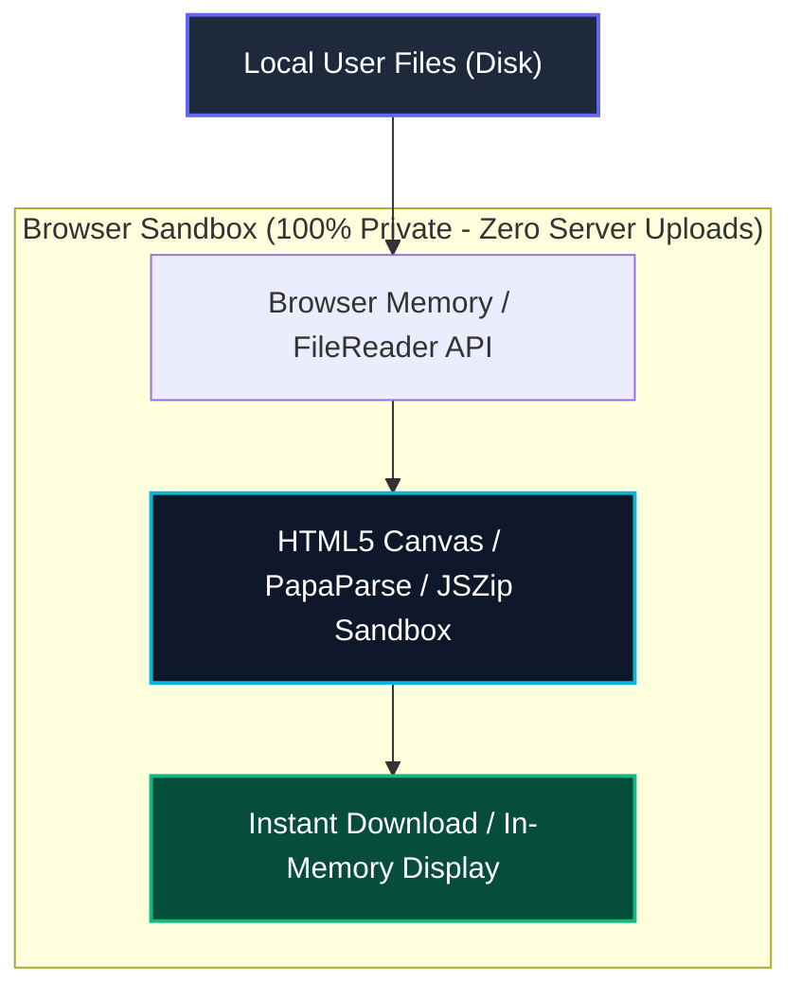

<div align="center">

  <h1>⚡ OmniFile Studio</h1>
  <p><strong>The Ultimate 100% Client-Side Universal File Workspace, Viewer & Multi-Format Converter</strong></p>
  <p><em>Zero Server Uploads • 100% Data Privacy • High-Performance Browser Engine</em></p>

  <p>
    <a href="https://github.com/KetineniRamarao/omni-file-studio"></a>
    <a href="https://github.com/KetineniRamarao/omni-file-studio"></a>
    <a href="https://github.com/KetineniRamarao/omni-file-studio"></a>
    <a href="https://github.com/KetineniRamarao/omni-file-studio"></a>
    <a href="https://github.com/KetineniRamarao/omni-file-studio"></a>
    <a href="https://github.com/KetineniRamarao/omni-file-studio"></a>
    <a href="https://github.com/KetineniRamarao/omni-file-studio"></a>
  </p>

  <br />

  <p>
    <a href="https://KetineniRamarao.github.io/omni-file-studio"><strong>🌐 Launch Live Application »</strong></a>
    &nbsp;•&nbsp;
    <a href="#-quick-start"><strong>🚀 Quick Start</strong></a>
    &nbsp;•&nbsp;
    <a href="#-deep-dive-feature-suite"><strong>✨ Feature Guide</strong></a>
  </p>

</div>

---

## 📖 Overview & Motivation

**OmniFile Studio** is a privacy-first, zero-dependency web workspace built to view, inspect, convert, and archive files directly inside your browser. 

Traditional online file converters force users to upload sensitive personal documents, financial spreadsheets, images, and media to third-party servers. OmniFile Studio eliminates this risk entirely by executing **100% of processing client-side** using modern browser APIs (`FileReader`, `HTML5 Canvas`, `Blob`, `URL.createObjectURL`, `PapaParse`, `JSZip`, and `jsPDF`).

Whether you need to inspect raw CSV records in an interactive data grid, play video files, convert image formats with custom compression, export documents to PDF, or zip multiple files into a single archive—**OmniFile Studio handles it instantly without uploading a single byte**.

---

## ✨ Deep-Dive Feature Suite

### 🎨 1. Multi-Theme Visual Engine
Personalize your workspace with 4 curated aesthetic themes accessible directly from the top navigation bar:
- **⚡ Cyberpunk Neon**: Deep space void backdrop with glowing indigo and cyan accents.
- **🌙 Dark Slate**: Clean charcoal background paired with electric blue typography.
- **☀️ Light Modern**: Crisp ceramic white glassmorphism with vivid blue accents.
- **🕹️ 80s Synthwave**: Retro 80s CRT grid vibes with neon pink glow and pixel font headers.

### 📊 2. Interactive CSV & Text Data Inspector
- **CSV Data Grid**: Automatically parses raw CSV files into an interactive, scrollable data table with sticky column headers, alternating row highlights, and record counts.
- **Syntax Reader**: High-contrast code viewer for `JSON`, `XML`, `TXT`, `Markdown`, `JavaScript`, `HTML`, `CSS`, and `Python` with a one-click copy button.

### 🎥 3. Media & Image Viewer Engine
- **Native Video & Audio Players**: Stream MP4, WebM, MP3, WAV, and OGG media directly within the inspection modal.
- **Isolated Content Zooming**: Zoom in (`0.25x` to `4.0x`), zoom out, or reset (`100%`) image/text content **without altering your browser tab's zoom level**.
- **Mouse Wheel Zoom Intercept**: Scroll over image/code containers to scale content smoothly.
- **90° Image Canvas Rotation**: Rotate photos on the fly.
- **High-Visibility Close Controls**: Fixed top-right red **`✕ Close (Esc)`** button and keyboard `Esc` shortcut.

### ⚡ 4. Universal Client-Side Converter
- **Image Conversion**: PNG ↔ JPG/JPEG ↔ WEBP ↔ ICO with a quality slider (`10%` to `100%`) and custom width/height pixel resizing.
- **Data Conversion**: CSV ↔ JSON, JSON ↔ XML.
- **Document Export**: Text & Markdown ↔ HTML, and direct export to PDF.
- **Batch Processing**: Convert individual items or select multiple items for batch conversion.

### 📦 5. Batch Selection & ZIP Archiving
- Multi-select files using checkboxes or "Select All".
- Compress selected items into a single downloadable **`.zip` archive** with one click using `JSZip`.

### 🔍 6. Real-Time Workspace Search & Layouts
- **Instant Search**: Filter loaded files in real-time by name, extension, or MIME type.
- **Grid vs. List Toggle**: Switch between visual thumbnail cards or compact data rows.
- **Workspace Dashboard**: Live header banner displaying total loaded files, memory size (MB), and converted item metrics.

---

## 🛠️ Tech Stack & Architecture

| Technology | Category | Purpose & Implementation |
| :--- | :--- | :--- |
| **HTML5 & Web APIs** | Core Markup | DOM rendering, File API, HTML5 Canvas, Blob URLs, Web Video/Audio |
| **Vanilla CSS3** | Styling & UI | Glassmorphic cards, CSS variables, keyframes, theme tokens, custom scrollbars |
| **JavaScript (ES6+)** | Core Engine | Event delegation, async file reading, Canvas context drawing, CORS prevention |
| **React 18** | UI Framework | Component state management, modal overlays, theme switching, layout toggles |
| **Vite 5** | Build System | Fast development server & relative path asset building for GitHub Pages |
| **PapaParse 5** | Data Parser | Client-side CSV parsing to JSON objects and JSON to CSV formatting |
| **JSZip 3** | Zip Engine | In-memory file compression & client-side `.zip` bundle generation |
| **jsPDF 2** | PDF Generator | Converting text/HTML content into downloadable PDF documents |
| **GitHub Pages** | Hosting | Static site delivery over HTTPS with automatic SSL certificates |

---

## 🔒 Security & Privacy Audit



### Security Breakdown:
- **Zero Server Vulnerabilities**: The application contains **no backend server, no database, and no cloud storage**. Hackers have no server or database to attack.
- **Zero Network Transmission**: All operations run inside browser RAM. No data is sent across the network.
- **Global Drag & Drop Lock**: Custom event handlers prevent browsers from navigating away or auto-downloading dropped media files.

---

## 📁 Repository Structure

```
omni-file-studio/
├── 🌐 index.html          # Standalone single-file application (Double-click to run)
├── 📄 package.json        # Package metadata & build scripts
├── ⚡ vite.config.js       # Vite configuration for relative base path loading
├── 📖 README.md           # Documentation & user manual
├── 🛡️ .gitignore          # Ignores OS temp files & build output
├── 📁 test-files/         # Sample test files for instant testing
│   ├── sample_employees.csv
│   ├── sample_data.json
│   ├── sample_notes.md
│   └── sample.svg
└── 📁 src/                # Modular React source files & CSS stylesheet
    ├── App.jsx
    ├── index.css
    ├── main.jsx
    ├── components/
    └── utils/
```

---

## 🚀 Quick Start

### Option 1: Double-Click Launch (Easiest)
1. Open the project folder on your computer.
2. Double-click **`index.html`** to launch the full application in your browser instantly—no server required!

### Option 2: Development Server Setup
```bash
# Clone repository
git clone https://github.com/KetineniRamarao/omni-file-studio.git

# Enter project directory
cd omni-file-studio

# Install dependencies
npm install

# Start local server
npm run dev
```

---

## 🌐 GitHub Pages Deployment Guide

To deploy your own copy of OmniFile Studio on GitHub Pages:

1. Push your code to your GitHub repository:
   ```bash
   git add .
   git commit -m "Initial commit of OmniFile Studio"
   git push -u origin main
   ```
2. Navigate to your repository on GitHub.
3. Click **Settings** (top bar) ➔ **Pages** (left sidebar).
4. Under **Branch**, select **`main`** and click **Save**.
5. Your live app link will be active at: `https://YOUR_USERNAME.github.io/omni-file-studio`

---

<div align="center">
  <p>Built with ❤️ by <a href="https://github.com/KetineniRamarao">KetineniRamarao</a> using HTML5, CSS3, React & Vite</p>
</div>
